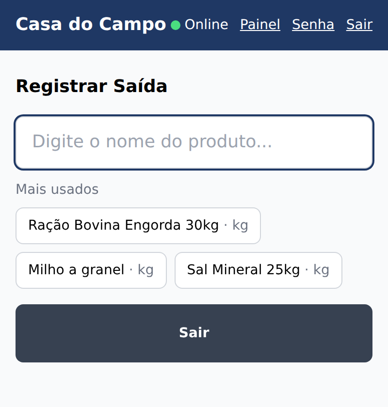
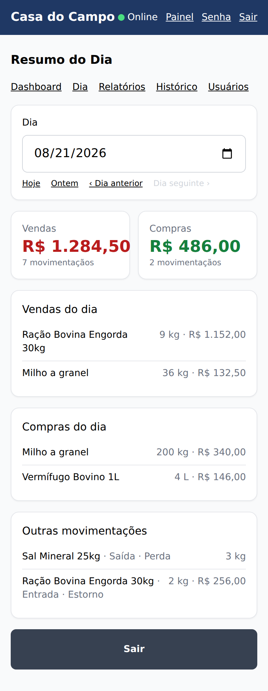
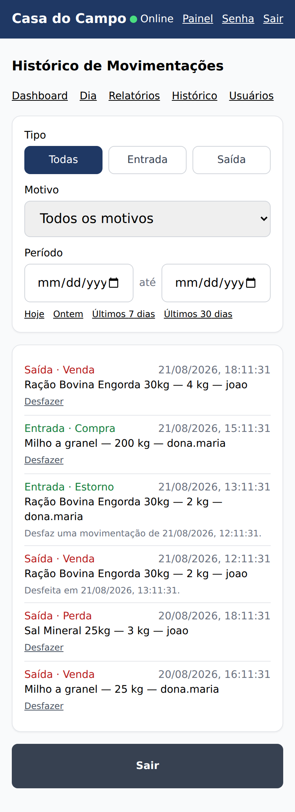
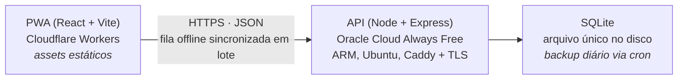

# Casa do Campo — Estoque

[](https://github.com/SergioGuthyerres/CONTROLE-ESTOQUE/actions/workflows/ci.yml)

**▶ Aplicação no ar: <https://controle-estoque.sergioguthyn.workers.dev/>**

Controle de estoque para uma loja de produtos agropecuários, em uso real pelos
donos. É um PWA instalável no celular que **funciona sem internet**: o
funcionário registra venda e compra offline, e o aparelho sincroniza sozinho
quando a conexão volta. Backend próprio em VPS gratuita, custo de operação
zero.

O problema não é "fazer um CRUD de estoque". É fazer um sistema que continua
funcionando num lugar onde a internet cai, para pessoas que não vão pedir
ajuda quando algo der errado.

| Registrar saída (venda) | Resumo do dia | Histórico com desfazer |
|---|---|---|
|  |  |  |

## Arquitetura de produção



Frontend e backend em provedores diferentes de propósito: o PWA é um punhado
de arquivos estáticos e a borda da Cloudflare os entrega de graça, perto do
usuário, com HTTPS resolvido. A API precisa de disco persistente e de um
processo que não morre entre requisições — o que os planos gratuitos de
função serverless não dão. A instância ARM Always Free da Oracle dá as duas
coisas por R$ 0, e o Caddy resolve o certificado sozinho.

O preço dessa escolha é o CORS entre dois domínios e o token em
`localStorage` em vez de cookie `httpOnly` — decisão registrada e revisável em
[docs/ARCHITECTURE.md](docs/ARCHITECTURE.md). O passo a passo completo do
deploy está em [deploy/README-DEPLOY.md](deploy/README-DEPLOY.md).

## Como funciona a sincronização offline

Esta é a parte tecnicamente mais difícil do projeto, então vale explicar em
detalhe — inclusive o que ela **não** resolve.

### O modelo de dados é o que torna o offline simples

`Movimentacao` é **append-only**: nunca existe `UPDATE` nem `DELETE`. O
estoque de um produto não é um campo que se sobrescreve, é sempre a soma das
movimentações dele (`entrada` soma, `saida` subtrai).

Isso elimina a classe inteira de conflito de escrita. Dois celulares offline
não disputam a mesma linha, porque ninguém edita linha nenhuma — cada um só
acrescenta registros seus. Sincronizar é concatenar, e concatenação não tem
conflito.

Até "desfazer" segue a regra: desfazer uma movimentação cria a **movimentação
inversa**, ligada à original por `estornoDeId`. O estoque se corrige sozinho
(porque é soma), o erro e a correção ficam os dois visíveis no histórico, e a
sincronização continua sendo só concatenação.

### A fila e como ela é drenada

1. Toda entrada/saída é gravada no IndexedDB (Dexie), com um **UUID gerado no
   cliente** e `sincronizada: 0`. A tela não espera a rede: navega de volta na
   hora.
2. `src/lib/sync.ts` tenta um ciclo ao logar, quando o navegador dispara
   `online`, quando o app volta ao primeiro plano (`visibilitychange`) e a
   cada 60 s. O gatilho de primeiro plano existe porque o sistema do celular
   congela o `setInterval` de um app em segundo plano.
3. Um ciclo tem duas metades independentes: **subir** a fila e **descer** o
   catálogo. Nessa ordem — descer antes traria um estoque que ainda não
   contabiliza o que este aparelho fez.
4. A fila sobe em lotes de 200, da movimentação mais antiga para a mais nova.
   Cada lote é marcado como sincronizado assim que o servidor confirma, então
   uma conexão que cai no meio não perde o que já chegou.
5. O servidor grava com `upsert` pelo id do cliente. **Reenviar é seguro**: um
   lote repetido por retry de rede não duplica nada. É por isso que o app pode
   tentar de novo sem controle de estado nenhum.

### Qual é a estratégia de resolução de conflito

**Não existe resolução de conflito, e isso é intencional.** Não é
last-write-wins: é *no-write-wins*, porque nada é sobrescrito.

O que acontece nos casos concretos:

- **A mesma venda lançada duas vezes, em aparelhos diferentes.** Viram duas
  movimentações, e o estoque cai duas vezes — que é o comportamento correto,
  porque o sistema não tem como saber se foram duas vendas iguais ou a mesma
  venda digitada duas vezes. A correção é humana: desfazer uma delas pelo
  histórico.
- **Dois aparelhos vendem o mesmo produto offline até zerar o estoque.** Os
  dois lançamentos entram, e o saldo calculado fica **negativo**. O sistema
  não tenta impedir — impedir exigiria coordenação online, que é exatamente o
  que não existe nesse momento. Em vez disso o estoque negativo é um alerta
  de primeira classe no painel (RF10), com o `origemDispositivo` de cada
  movimentação para rastrear de qual aparelho veio.
- **Venda grande offline.** Acima de 20 unidades (configurável), o app exige
  internet e confere o estoque no servidor antes de deixar confirmar. É a
  única operação que depende de conexão, porque é onde um número desatualizado
  custa caro.
- **Cadastro de produto e de categoria.** Só online. São ações raras — não é o
  dia a dia — e deixá-las offline traria de volta o conflito de edição que o
  resto do modelo evita.

### O que a tela mostra enquanto a fila não drenou

O estoque exibido é **otimista**: o último valor confirmado pelo servidor mais
o efeito das movimentações locais ainda não enviadas. Depois que a fila drena
e o catálogo desce, as pendentes já foram contabilizadas pelo servidor e saem
da conta local — sem contar em dobro. Um indicador no topo mostra
online/offline e quantas movimentações faltam enviar.

### Limitações conhecidas

- **Movimentação com mais de 90 dias é recusada pelo servidor.** A data vem do
  relógio do celular (é o preço de aceitar lançamento offline), e sem limite
  um aparelho com data errada sujaria todo o histórico. O efeito colateral: um
  aparelho que ficasse mais de 90 dias sem internet teria o lote recusado, e
  hoje a fila não separa o item inválido do resto do lote.
- **Não há resolução automática de duplicata.** Duas pessoas registrando a
  mesma venda geram duas linhas; quem percebe é gente, e o conserto é o
  desfazer do histórico.
- **O catálogo desce inteiro a cada ciclo.** Com dezenas de produtos isso é
  irrelevante; com milhares, valeria sincronização incremental por
  `atualizadoEm`.

## Decisões técnicas

**PWA, não app nativo.** Publicar na App Store exige conta paga da Apple
(~US$ 99/ano), e o orçamento do projeto é zero — o mesmo motivo que descartou
serviço gerenciado de banco e de backend. O PWA instala na tela inicial pelo
próprio navegador, nos dois sistemas, e se atualiza sozinho a cada deploy, sem
loja e sem o cliente precisar aprovar atualização. A troca: sem notificação
push confiável no iOS e sem acesso a hardware — nada que o sistema use.

**SQLite, não Postgres.** O volume é de 50 a 150 movimentações por dia e
dezenas de produtos; um banco separado adicionaria um serviço para manter,
monitorar e fazer backup, em troca de uma capacidade que não vai ser usada. O
banco é um arquivo, o backup é `VACUUM INTO` (e não `cp`, que num SQLite em
uso pode gerar arquivo corrompido) e a restauração é copiar o arquivo de
volta. Se um dia precisar migrar, o Prisma abstrai o dialeto e o custo fica na
migração dos dados, não na reescrita do código.

**Dexie sobre IndexedDB, não `localStorage`.** O `localStorage` é síncrono,
trava a thread da interface e guarda só string — colocar a fila de
movimentações nele significaria serializar e reserializar o array inteiro a
cada venda. IndexedDB é assíncrono, indexado e tem transação, mas a API crua é
verbosa a ponto de convidar ao erro. O Dexie cobre isso com tipagem e com
`useLiveQuery`, que faz a tela reagir sozinha a mudanças no banco local — é o
que mantém o contador de pendentes correto sem nenhum código de sincronização
de estado.

**Estoque calculado, nunca armazenado.** É a decisão que sustenta todo o
resto: sem um campo de saldo, não há nada para dois aparelhos disputarem. O
custo é somar movimentações a cada consulta — irrelevante nesta escala, e a
saída, se um dia doer, é um saldo em *cache* reconstruível, nunca um saldo que
vira a fonte da verdade.

**Token de 30 dias, verificado no banco a cada requisição.** Login frequente é
atrito para o público do sistema, mas token longo sem revogação é celular
perdido autenticado por um mês. Os campos `ativo` e `tokenVersion`, conferidos
a cada requisição, permitem derrubar uma sessão na hora. Com poucos usuários
num SQLite local, a consulta extra não se mede.

## O que o sistema faz

- Cadastro de produto e categoria; busca do produto por nome, com atalhos para
  os mais movimentados na tela de venda e de compra
- Registro de entrada e saída offline, com motivo (compra, venda, perda, uso
  interno, devolução, ajuste de inventário)
- Desfazer movimentação pelo histórico, por estorno (sem apagar nada)
- Histórico filtrável por tipo, motivo, dia e intervalo de datas
- Resumo do dia: totais de venda e de compra, e o que girou em cada um
- Relatórios por período, com quebra por entrada/saída e por motivo, e valor
  total em estoque por custo médio
- Alertas de estoque mínimo e de estoque negativo
- Gestão de usuários com dois perfis, senha provisória obrigatória na
  primeira entrada e revogação imediata de acesso
- Backup diário automático do banco

## Testes e integração contínua

```bash
cd backend  && npm test        # regras de segurança e de negócio, sem banco
cd backend  && npm run typecheck
cd frontend && npm test        # sincronização offline, IndexedDB em memória
cd frontend && npm run build   # o tsc -b faz o typecheck do PWA
```

No backend, `testes/seguranca.test.ts` cobre as regras que separam este
sistema de um sistema aberto: enumeração de usuário no login, RBAC das rotas
de admin, invalidação de sessão (`ativo` e `tokenVersion`), proteção do último
admin, senha provisória que não vira permanente, força bruta no login, CORS e
o erro de banco que antes deixava a requisição pendurada. Cada teste
corresponde a uma brecha que existiu de verdade neste repositório — inclusive
um que **recusa as senhas de exemplo que já estiveram publicadas neste
README**. Os demais arquivos cobrem as regras de negócio puras: estorno,
classificação do resumo e agregação do relatório.

Todos rodam com um Prisma falso em memória (`backend/testes/prismaFalso.ts`),
sem banco, sem engine nativo e sem internet.

No frontend, `testes/sync.test.ts` cobre a sincronização offline — a fila em
lotes, a atualização do catálogo e o estoque otimista — com IndexedDB em
memória (`fake-indexeddb`), sem navegador. `testes/datas.test.ts` cobre a
conversão de fuso que decide em qual dia cada venda cai.

O [workflow do GitHub Actions](.github/workflows/ci.yml) roda em todo PR e em
todo push na `main`: testes e typecheck do backend, aplicação das migrations
num SQLite descartável, testes do frontend e build completo do PWA. O badge no
topo mostra o estado da `main`.

Depois do CI verde num push na `main`, o mesmo workflow **publica a API** por
SSH: backup do banco, migrations, restart e health check — com rollback
automático para o commit anterior se a API não responder. O PWA já se publicava
sozinho pelo Cloudflare; automatizar o outro lado fecha a janela em que o app
novo conversa com uma API que ainda não tem as rotas dele. A chave de deploy
guardada no GitHub é presa a um único comando (`command=` no `authorized_keys`),
então nem vazada ela abre um shell no servidor.

## Rodando localmente

Precisa de Node 20+ e de dois terminais:

```bash
# terminal 1
cd backend
npm install
cp .env.example .env
npm run prisma:migrate
npm run seed:dev       # imprime senhas sorteadas, válidas só neste banco
npm run dev            # http://localhost:3000

# terminal 2
cd frontend
npm install
cp .env.example .env
npm run dev            # http://localhost:5173
```

O `seed:dev` sorteia as senhas a cada execução e as imprime no terminal, em
vez de trazê-las escritas no repositório. Ele se recusa a rodar com
`NODE_ENV=production`; em produção o usuário dos donos é criado por
`npm run criar-admin`, com senha digitada por eles e sem eco no terminal.

## Estrutura

```
backend/   API (Node + Express + Prisma + SQLite) — ver backend/README.md
frontend/  PWA (React + Vite + Dexie) — ver frontend/README.md
deploy/    Arquivos e guia de produção — ver deploy/README-DEPLOY.md
docs/      Documentos de produto e arquitetura
```

Antes de mexer no código:

1. [docs/ARCHITECTURE.md](docs/ARCHITECTURE.md) — "onde mexer para cada tipo
   de mudança", e as três regras que nenhuma alteração pode quebrar.
2. [docs/documento-de-visao.md](docs/documento-de-visao.md) — o problema e as
   restrições de negócio que explicam as decisões.
3. [docs/especificacao-requisitos.md](docs/especificacao-requisitos.md) —
   requisitos numerados (RF/RNF) e modelo de dados.

## Contribuindo

Nada entra na `main` por commit direto: toda mudança nasce numa branch e entra
por Pull Request com o CI verde. O fluxo, a convenção de nomes e o que um PR
precisa ter estão em [CONTRIBUTING.md](CONTRIBUTING.md).

## Próximos passos

- Cópia dos backups para fora da VPS e um teste de restauração de verdade
  (um backup que só existe na mesma máquina não protege contra perder a
  máquina)
- Testes de ponta a ponta do fluxo completo num navegador real
- Identidade visual definitiva com o cliente
