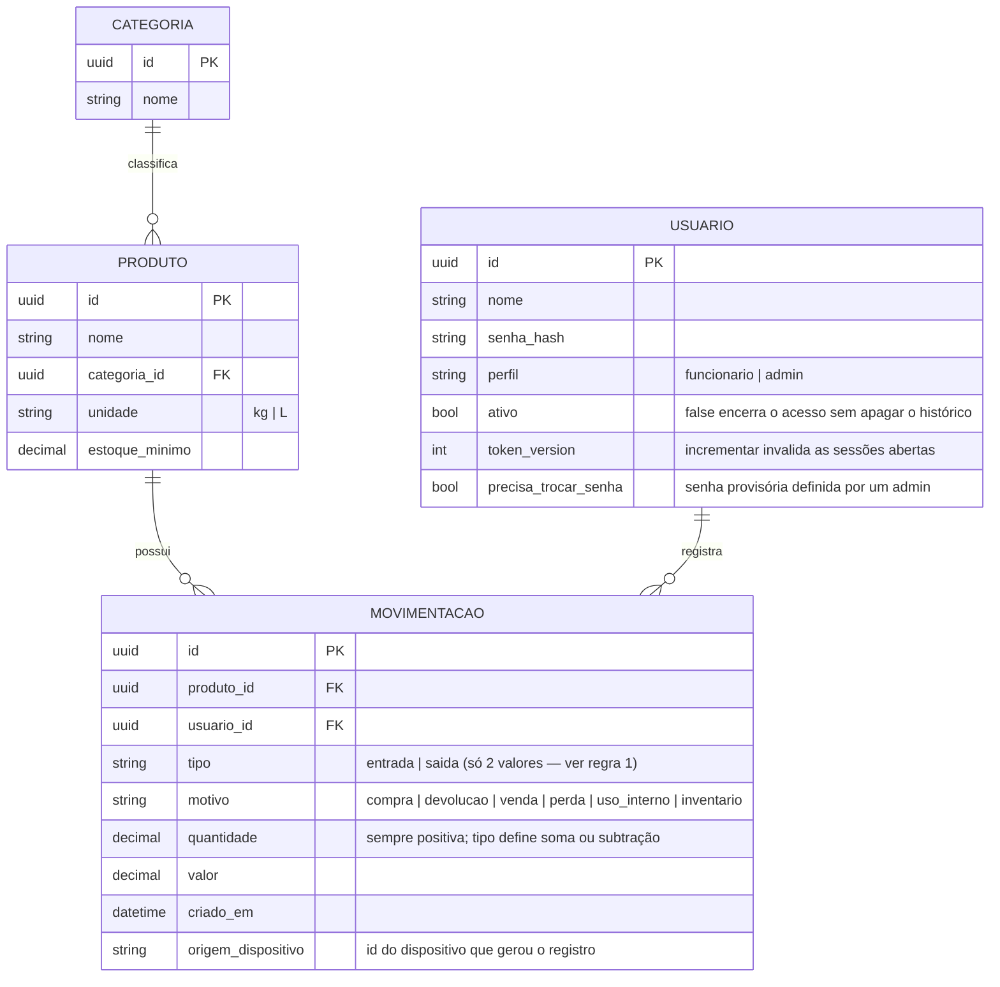

# Especificação de Requisitos — Estoque Casa do Campo

> Detalha, em termos técnicos, o que está definido em
> [documento-de-visao.md](./documento-de-visao.md). Qualquer mudança de
> escopo deve refletir os dois documentos.

## 1. Requisitos Funcionais (RF)

### Cadastros
- **RF01** — Cadastrar, editar e listar Produto (nome, categoria, unidade — kg/L, estoque mínimo)
- **RF02** — Cadastrar, editar e listar Categoria

### Movimentação de estoque
- **RF03** — Registrar entrada de estoque (produto, quantidade, valor, tipo: compra/devolução)
- **RF04** — Registrar saída de estoque (produto, quantidade, valor, tipo: venda/perda/uso interno)
- **RF05** — Registrar ajuste manual de estoque (inventário/contagem): contagem física a mais vira `entrada`, a menos vira `saida`, ambas com motivo `inventario` — não é um terceiro tipo de movimentação (ver Modelo de Dados)
- **RF06** — Identificar o produto na movimentação por busca textual (nome/descrição) — campo único, sem distinção de atalhos (decisão da seção 5.1 da visão)
- **RF07** — Bloquear confirmação de saída com quantidade > 20 unidades iguais quando o dispositivo estiver offline; exigir conexão e checagem do estoque no servidor antes de liberar (seção 5.2 da visão)

### Painel administrativo
- **RF08** — Dashboard com estoque total, giro e lista de alertas ativos
- **RF09** — Alerta de estoque mínimo (produto abaixo do limite cadastrado)
- **RF10** — Alerta de estoque negativo (produto com saldo calculado < 0)
- **RF11** — Relatório de produtos mais/menos movimentados (por período)
- **RF12** — Relatório de valor total em estoque
- **RF13** — Histórico/auditoria de movimentações (quem, o quê, quando — somente leitura, nunca editável)

### Acesso
- **RF14** — Login individual por usuário, com dois perfis: Funcionário e Admin
- **RF15** — Funcionário acessa cadastro de produto/categoria e movimentações; Admin acessa tudo, incluindo dashboard e relatórios
- **RF16** — Backup automático do banco do servidor (rotina agendada, sem intervenção manual)

## 2. Requisitos Não Funcionais (RNF)

- **RNF01** — Interface acessível via navegador mobile, instalável como PWA (Android e iOS), sem loja de aplicativos
- **RNF02** — Funcionar 100% offline para RF03–RF06 (exceto o caso do RF07); dados gravados localmente e sincronizados quando houver internet
- **RNF03** — Nenhuma movimentação sincronizada pode sobrescrever outra — sincronização é sempre aditiva (ver Modelo de Dados, seção 3)
- **RNF04** — Custo de operação (hospedagem, banco, sincronização) igual a zero; back-end self-hosted em VPS de camada gratuita permanente
- **RNF05** — Interface com o mínimo de campos e passos possível por tela, adequada a usuários com baixa familiaridade digital
- **RNF06** — Nenhuma ação do Funcionário pode ficar bloqueada por falha de sincronização, exceto a regra explícita do RF07

## 3. Modelo de dados

### Regras de negócio explícitas

1. **Estoque de um produto = soma de todas as suas movimentações**, nunca um
   campo separado que se sobrescreve. `entrada` sempre soma, `saída` sempre
   subtrai — `quantidade` é sempre positiva, o sinal vem só do `tipo`. Ajuste
   de inventário não é um tipo à parte: contagem a mais é `entrada` (motivo
   `inventario`), a menos é `saida` (motivo `inventario`).
2. **`MOVIMENTACAO` é append-only.** Não existe update nem delete — uma
   correção é sempre uma nova movimentação (ex: tipo `ajuste`), preservando o
   histórico completo (RF13).
3. `origem_dispositivo` existe para rastrear de qual aparelho veio cada
   registro, útil para investigar estoque negativo (RF10).
4. A checagem do RF07 consulta o estoque **calculado no servidor** (não o
   local do dispositivo) antes de liberar uma saída grande — é a única
   operação que depende de estar online.

## 4. Fora de escopo desta especificação

Tudo listado na seção 7 do documento de visão (QR Code, fotos, validade,
múltiplas lojas, clientes/fornecedores, nota fiscal, integrações, 2FA)
permanece fora até uma revisão futura.
